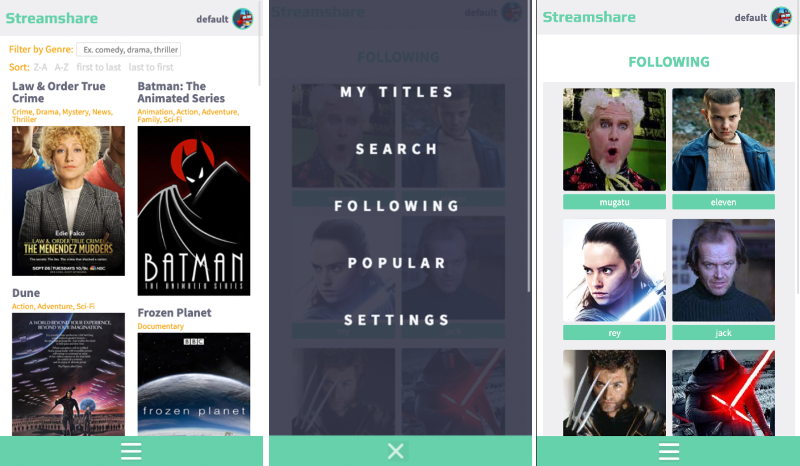
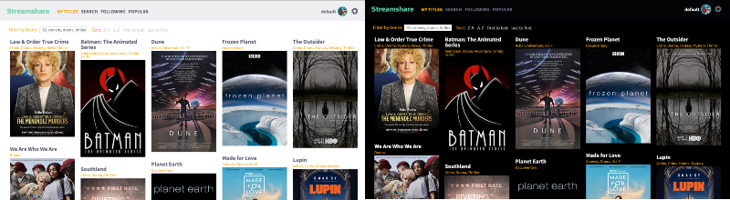
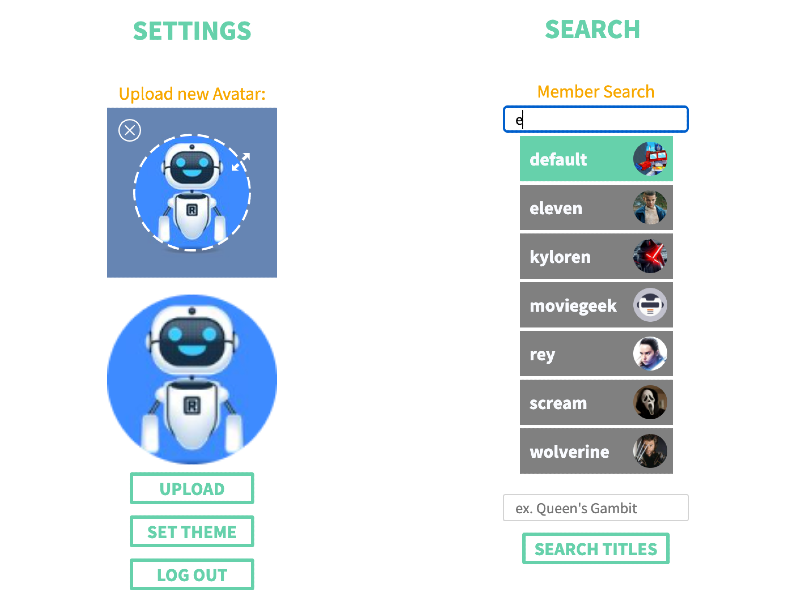

# Streamshare


### About

```bash
Concordia University Full-Stack Web Development Bootcamp final Project.

Search movies, TV and video games.

Add titles to your list.

Follow friends and find new titles.
```

### Technologies

```bash
React, Javascript, Styled Components, CSS, Redux, Node.js, Express, MongoDB, Git

```

### Click below for full video demo

[](http://www.youtube.com/watch?v=9lajlW-6LXY)

### Features

<h4>Fully-responsive (mobile first)</h4>


<h4>Light/Dark Mode</h4>


<h4>Accessible typeahead user search & Scale and crop avatar uploader </h4>


### Additional

Filter by Genre / Sort by various parameters

Random avatar generation on account creation

Active member vs new member state

Shareable public profile link

Auto login and persistent theme setting on revisit/refresh

Error handling (Field inputs, non-existing members, non-existing urls, page re-direction etc)
